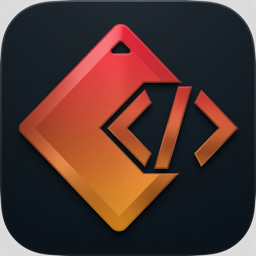

# CoFound



Web MCP native ideation canvas. Mix stacks the way [Little Alchemy](https://littlealchemy.com/) mixes elements: two pieces make one idea.

Live: [cofound-wzks.onrender.com](https://cofound-wzks.onrender.com)

Three fields: **Sponsors**, **Industries**, **Wild cards**. Click two chips to combine them. Download the board when you are done. An agent can run the same moves on the page.

Industries ships with Health, Education, Defense, Finance, Entertainment, Sports, Climate, Legal, Accessibility, Eldercare. Sponsors and Wild cards start empty. Add this weekend’s tools by typing, dropping a `.txt` / `.md` / `.html` list, or an agent calling `add_element` / `ingest_doc`.

## Features

- Little Alchemy combine: two pieces, one idea
- Three colored fields (amber / teal / purple)
- Drop a hackathon or sponsor doc to register stacks named in that file
- SCAMPER on an idea
- Download `ideation-canvas.md`
- Web MCP on the page

## Prerequisites

- Node.js 20.9+

## Getting started

```bash
npm install
npm run dev
```

Open the URL Next prints (often [http://localhost:3000](http://localhost:3000)).

## Usage

1. Put stacks in the fields (type, drop a doc, or let an agent add them).
2. Click one piece, then another, to combine them like Little Alchemy.
3. Optional: **Push with SCAMPER**.
4. **Download**.

Double-click a piece to remove it. **Clear** resets the board. Industries come back as the starter set.

## Web MCP

Agents call `window.WebMCP` or JSON-RPC `postMessage` (`tools/list`, `tools/call`):

| Tool | What it does |
|---|---|
| `list_palette` | List the three fields |
| `add_element` | Add a piece (`kind`: sponsor, industry, or wild) |
| `ingest_doc` | Register stacks named in pasted text |
| `combine` | Combine two pieces by name |
| `list_ideas` | List ideas |
| `scamper` | Run SCAMPER on an idea id |
| `download_canvas` | Download markdown (asks first) |
| `reset_canvas` | Clear the board (asks first) |

## Scripts

| Command | What it runs |
|---|---|
| `npm run dev` | Next.js dev server |
| `npm run build` | Production build |
| `npm run start` | Serve the production build |

## Limits

- Combinations come from the two names you clicked.
- The board is `localStorage` on that browser.
- PDF drop is not supported. Use txt, md, or html.

Deploy notes: [DEPLOYMENT.md](DEPLOYMENT.md).
