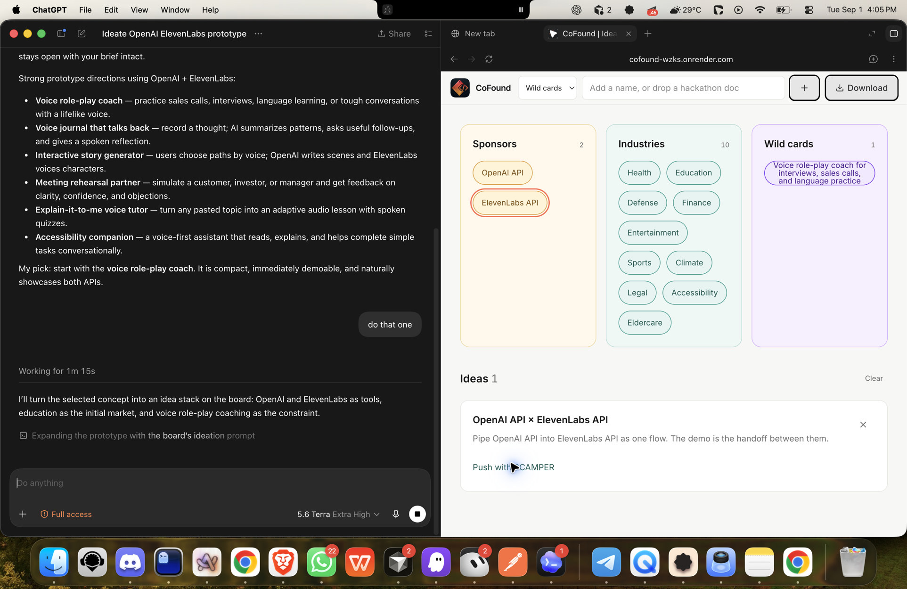
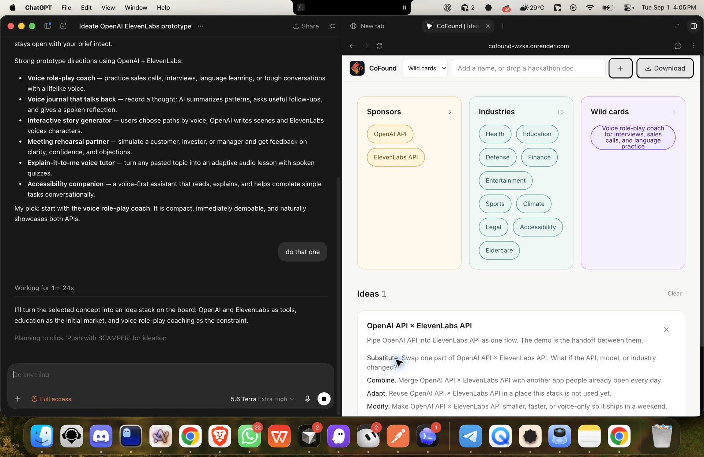

# CoFound


Web MCP native ideation canvas.

Live: [cofound-wzks.onrender.com](https://cofound-wzks.onrender.com)

The board has three fields: **Sponsors**, **Industries**, and **Wild cards**. Click two chips to combine them. Download saves the board as markdown. An agent can run the same actions on the page through Web MCP.

Industries starts with Health, Education, Defense, Finance, Entertainment, Sports, Climate, Legal, Accessibility, and Eldercare. Sponsors and Wild cards start empty. Add stacks by typing a name, dropping a `.txt`, `.md`, or `.html` file, or having an agent call `add_element` or `ingest_doc`.

## Features

- Combine two chips into an idea
- Three fields: Sponsors (amber), Industries (teal), Wild cards (purple)
- Drop a txt, md, or html file to add stacks named in that file
- SCAMPER on an idea
- Download `ideation-canvas.md`
- Web MCP on the page

## Prerequisites

- Node.js 20.9+

## Getting started

```bash
npm install
npm run dev
```

Open [http://localhost:3000](http://localhost:3000) or the live app: [cofound-wzks.onrender.com](https://cofound-wzks.onrender.com).

## If you are new

The board is three columns.

1. **Sponsors** (amber) starts empty. Type a tool name, drop a txt/md/html sponsor list, or ask an agent to add them.
2. **Industries** (teal) already has Health, Education, Defense, Finance, Entertainment, Sports, Climate, Legal, Accessibility, and Eldercare.
3. **Wild cards** (purple) starts empty. Add a constraint such as Voice-only.
4. Click a chip in one column, then a chip in another. The idea shows up under **Ideas**.
5. Click **Push with SCAMPER** on that idea.
6. Click **Download** for `ideation-canvas.md`.

Double-click a chip to remove it. **Clear** resets the board and restores the industry list.

## Use it in Codex

Enter https://cofound-wzks.onrender.com in the Codex browser. The agent cannot open the page itself.
3. Paste this:

Hello, I want to create a little prototype. I have an OpenAI API key and an ElevenLabs API key. Let's ideate what I can build.





## Web MCP

Agents call `window.WebMCP` or JSON-RPC `postMessage` (`tools/list`, `tools/call`):

| Tool | What it does |
|---|---|
| `list_palette` | List the three fields |
| `add_element` | Add a piece (`kind`: sponsor, industry, or wild) |
| `ingest_doc` | Register stacks named in pasted text |
| `combine` | Combine two pieces by name |
| `list_ideas` | List ideas |
| `scamper` | Run SCAMPER on an idea id |
| `download_canvas` | Download markdown (asks first) |
| `reset_canvas` | Clear the board (asks first) |

## Scripts

| Command | What it runs |
|---|---|
| `npm run dev` | Next.js dev server |
| `npm run build` | Production build |
| `npm run start` | Serve the production build |

## Limits

- Combinations come from the two names you clicked.
- The board is `localStorage` on that browser.
- PDF drop is not supported. Use txt, md, or html.

Deploy notes: [DEPLOYMENT.md](DEPLOYMENT.md).
